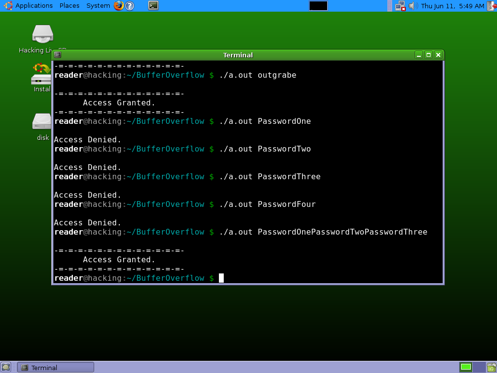

# BufferOverflow
## Task: даны две программы с возможностью переполнения буфера. Нужно найти способы получить в них сообщение об успешном логине.

### 1. Настройка ОС и ПО
a. Один из самых простых способов подготовить ОС и ПО, где будут выполняться наши программы - это технологии виртуализации. В нашем случае на рабочей станции используется Windows, а одним из самых доступных ПО для вирутализации является Oracle VM VirtualBox, доступный для загрузки с https://www.virtualbox.org/. 

Создадим посредством VirtualBox виртуальную машину c Ubuntu и необходимым ПО. Основные настройки на скрине:

  

b. Обеспечим возможность обмена файлами между с гостевой ОС и запустим виртуалку. Одним из самых простых способов, которые предлагает VirtualBox - это настройка общего доступа папки либо использование USB-накопителя. 

c. Создадим в виртуальной машине папку BufferOverflow и разместим в ней исходный код наших программ.

### 2. Программа auth_overflow.c
a. Изучим исходный код программы auth_overflow.c. В main() метод поступает пароль, введенный пользователем, затем вызывается метод check_authentication(). В нем происходит вызов функции strcpy(), которая используется для копирования строки в заданный буфер (массив символов размером 16 байт). Далее происходит сравнение введенного пароля с возможными паролями "brillig" и "outgrabe". В случае, если check_authentication() не возвращает False, main() метод выводит баннер "Access Granted". 

b. Скомпилируем нашу программу посредством GСС, используя в частности команду с аргументами gcc -O0 -fno-stack-protector -no-pie -o auth_overflow auth_overflow.c из файла build.sh. Результатом будет файл a.out, который мы можем запускать, передавая пароль. Проверим работу программы, вводя различные пароли.

Как видим, корректные пароли позволяют пройти проверку метода check_authentication(), а не корректные такую проверку не проходят.

c. Попробуем воспроизвести кейс, когда введенный пароль вызывает переполнение буфера. Ведем пароль "PasswordOnePasswordTwoPasswordThree".

Как видим, передаваемая строка превышает пределы выделенного в памяти буфера и изменяет порядок размещения байтов в памяти. Теперь метод возвращает соответствующие натуральные числа без нуля. Основная уязвимость программы, заключается том, что блок операций выполняется в main(), когда условному оператору if передано любое ненулевое значение.    

### 3. Программа auth_overflow2.c
a. Подготовим и изучим программный код. Основное отличие в том, что в этой программе мы запрашиваем ввод пароля у пользователя. Для этого используется функция scanf(), которая считается уязвимой при использовании атак, направленных на переполнение буфера. Другое отличие этого примера заключается в том, что вывод сообщения об успешном логине обернуто в отдельный метод granted().

Скомпилируем приложение и проверим, что корректные пароли позволяют получить сообщение о логировании, а также воспроизведем кейс, в котором осуществляется ввод некорректного пароля.

b. Сгенерируем эксплоит, содержащий 32 символа “A”, при помощи языка Python, который уже установлен на виртуалке. Далее подцепимся дебаггером к программе, используя GDB, и проверим, что происходит при накате эксплоита.

### NB! 

Эксплоит длиной именно в 32 символа был выбран интуитивно, поясним, что стояло за этой логикой.
Обратим внимание на стек до того, как переданы наши параметры из эксплоита. Задав команду 'x/20x $esp', получим первые 20 значений из верхушки стека. Найдем в этой структуре место, где расположен вызов функции granted() (выделенная область на скрине):

 
Это место будет нашим таргетом, нам важно попасть точно с нашими значениями из эксплоита, иначе программа просто закрашится. Теперь нам нужно высчитать длину строки, конец которой заполнит это место. Для первого тест-кейса сгенерируем эксплоит, где будет 28 символов 'A' из расчета 4*7 (конвертер ASCII поможет нам прикинуть, сколько потребуется): 

Как видим, стек заполнился вплотную к нашему таргету. Далее нам нужно будет сгенерировать новый эксплоит и дозаполнить место в стеке.

c. Найдем адрес в памяти для функций granted() и scanf() в бинарнике.  Используя дизассемблер получим текст программы метода main() и зафиксируем значения, которые понадобятся нам для атаки.

Сделаем то же самое для метода check_authentication().

d. Для того, чтобы подробно рассмотреть состояние, зададим точки останова. Зададим точки останова до и после метода scanf() и проверим, как действует наш эксплойт на программу. В частности, посмотрим содержимое в кадре стека и убедимся, что значения из нашего эксплоита заполнены в стеке.

e. Совершим атаку, перенаправим выполнение программы на вызов метода granted(), используя значение места в памяти, которое мы зафиксировали ранее. 

Как мы видим, выполнение программы является некорректным и заканчивается ошибкой, однако при этом вызывается функция granted() и выводится сообщение об успешном логине. Проверим еще раз, что эксплоит оказывается успешным, происходит переполнение буфера и перенаправление выполнения программы. В боевой системе это означает, что программа отсыпет права на доступ злоумышленнику. Запустим обычный режим выполнения программы.

#### TODO:

Воспроизвести кейсы, используя подключение по SSH.